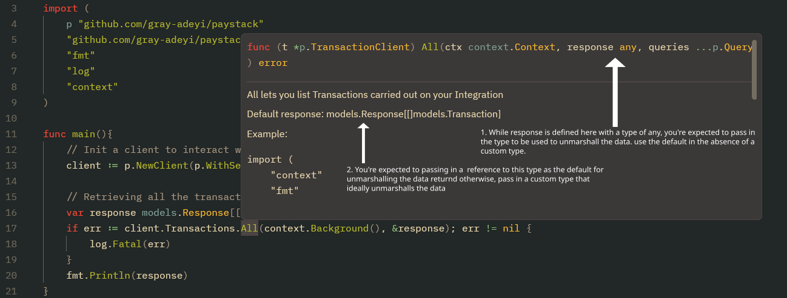

# Get Started

## Installation

```bash
go get -u github.com/gray-adeyi/paystack
```

## Usage

To use `github.com/gray-adeyi/paystack` in your Go project, start by
initializing a client and calling any of the available API methods. Here's a
basic example that retrieves all transactions associated with your integration:

```go
package main

import (
	"context"
	"fmt"
	"log"

	p "github.com/gray-adeyi/paystack"
	"github.com/gray-adeyi/paystack/models"
)

func main() {
	// Initialize a Paystack client with your secret key
	client := p.NewClient(p.WithSecretKey("<your-secret-key>"))

	// Prepare a response model to hold the returned transactions
	var response models.Response[[]models.Transaction]

	// Retrieve all transactions
	if err := client.Transactions.All(
		context.Background(), 
		&response,
		 p.WithQuery("perPage", "1"),
	); err != nil {
		log.Fatal(err)
	}

	fmt.Println(response.Status)
	fmt.Println(response.Message)
	fmt.Println(response.Data)
}
```

### Breakdown

#### Importing the package

```go
import (
	p "github.com/gray-adeyi/paystack"
	"github.com/gray-adeyi/paystack/models"
)
```

- The package is aliased as `p` to make function calls cleaner
  `p.NewClient(...)` instead of `paystack.NewClient(...)`.
- The `models` package contains all default response types used to deserialize
  API responses.

You may also need to import the enum package in some cases:

```go
import "github.com/gray-adeyi/paystack/enum"
```

This is especially useful when a method requires enum values as arguments. For
example, if a method accepts a `currency enum.Currency` argument, you can call
it like:

```go
ClientMethod(enum.CurrencyNgn)
```

#### Initializing the Client

```go
client := p.NewClient(p.WithSecretKey("<your-secret-key>"))
```

This initializes a new `PaystackClient` which provides access to all Paystack
services through structured method groupings. Each field on the `PaystackClient`
maps to a specific service, reflecting the structure of Paystack’s official
[REST API](https://paystack.com/docs/api/).

For example:

- `client.Transactions.All` →
  [List Transactions](https://paystack.com/docs/api/transaction/)
- `client.Transctions.Initialize` →
  [Initialize Transaction](https://paystack.com/docs/api/transaction/)

#### Client bindings

The `PaystackClient` exposes several grouped services, each corresponding to a
major section of the Paystack API. These include:

| Field name on `PaystackClient` | Client binding                  | Functionality                                                                                      | Example of methods available                                                       |
| ------------------------------ | ------------------------------- | -------------------------------------------------------------------------------------------------- | ---------------------------------------------------------------------------------- |
| `Transactions`                 | `TransactionClient`             | Provides all the methods for interacting with all the transactions related endpoints               | `client.Transactions.All`, `client.Transactions.Initialize`, e.t.c                 |
| `TransactionSplits`            | `TransactionSplitClient`        | Provides all the methods for interacting with all the transaction splits related endpoints         | `client.TransactionSplits.Create`,`client.TransactionSplits.All`, e.t.c.           |
| `Terminals`                    | `TerminalClient`                | Provides all the methods for interacting with all the terminal related endpoints                   | `client.Terminals.SendEvent`, `client.Terminals.EventStatus`, e.t.c.               |
| `Customers`                    | `CustomerClient`                | Provides all the methods for interacting with all the customers related endpoints                  | `client.Customers.Create`, `client.Customers.All`, e.t.c.                          |
| `DedicatedVirtualAccounts`     | `DedicatedVirtualAccountClient` | Provides all the methods for interacting with all the dedicated virtual accounts related endpoints | `client.DedicatedVirtualAccounts.Create`,`client.DedicatedVirtualAccounts.Assign`  |
| `ApplePay`                     | `ApplePayClient`                | Provides all the methods for interacting with all the apple pay related endpoints                  | `client.ApplePay.Register`, `client.ApplePay.All`, e.t.c.                          |
| `SubAccounts`                  | `SubAccountClient`              | Provides all the methods for interacting with all the sub accounts related endpoints               | `client.SubAccounts.Create`, `client.SubAccounts.All`, e.t.c.                      |
| `Plans`                        | `PlanClient`                    | Provides all the methods for interacting with all the plans related endpoints                      | `client.Plans.Create`, `client.Plans.All`, e.t.c                                   |
| `Subscriptions`                | `SubscriptionClient`            | Provides all the methods for interacting with all the subscriptions related endpoints              | `client.Subscriptions.Create`, `client.Subscriptions.All`, e.t.c.                  |
| `Products`                     | `ProductClient`                 | Provides all the methods for interacting with all the products related endpoints                   | `client.Products.Create`, `client.Products.All`, e.t.c.                            |
| `PaymentPages`                 | `PaymentPageClient`             | Provides all the methods for interacting with all the payment pages related endpoints              | `client.PaymentPages.Create`, `client.PaymentPages.All`, e.t.c.                    |
| `PaymentRequests`              | `PaymentRequestClient`          | Provides all the methods for interacting with all the payment requests related endpoints           | `client.PaymentRequests.Create`, `client.PaymentRequests.All`, e.t.c.              |
| `Settlements`                  | `SettlementClient`              | Provides all the methods for interacting with all the settlements related endpoints                | `client.Settlements.All`, `client.Settlements.AllTransactions`                     |
| `TransferRecipients`           | `TransferRecipientClient`       | Provides all the methods for interacting with all the transfer recipients related endpoints        | `client.TransferRecipients.Create`, `client.TransferRecipients.BulkCreate`, e.t.c. |
| `Transfers`                    | `TransferClient`                | Provides all the methods for interacting with all the transfers related endpoints                  | `client.Transfers.Initiate`, `client.Transfers.Finalize`, e.t.c.                   |
| `TransferControl`              | `TranferControlClient`          | Provides all the methods for interacting with all the transfer control related endpoints           | `client.TransferControl.Balance`, `client.TransferControl.BalanceLedger`, e.t.c.   |
| `BulkCharges`                  | `BulkChargeClient`              | Provides all the methods for interacting with all the bulk charge related endpoints                | `client.BulkCharges.Initiate`, `client.BulkCharges.All`, e.t.c.                    |
| `Integration`                  | `IntegrationClient`             | Provides all the methods for interacting with all the integration related endpoints                | `client.Integration.Timeout`,`client.Integration.UpdateTimeout`                    |
| `Charges`                      | `ChargeClient`                  | Provides all the methods for interacting with all the charge related endpoints                     | `client.Charges.Create`, `client.Charges.SubmitPin`, e.t.c                         |
| `Disputes`                     | `DisputeClient`                 | Provides all the methods for interacting with all the disputes related endpoints                   | `client.Disputes.All`, `client.Disputes.FetchOne`, e.t.c.                          |
| `Refunds`                      | `RefundClient`                  | Provides all the methods for interacting with all the refunds related endpoints                    | `client.Refunds.Create`, `client.Refunds.All`, e.t.c.                              |
| `Verification`                 | `VerificationClient`            | Provides all the methods for interacting with all the verification related endpoints               | `client.Verification.ValidateAccount`, `client.Verification.ResolveBin`            |
| `Miscellaneous`                | `MiscellaneousClient`           | Provides all the methods for interacting with all the miscellaneous related endpoints              | `client.Miscellaneous.Banks`,`client.Miscellaneous.Countries`,e.t.c.               |

Each of these provides a 1:1 mapping to the relevant sections in the
[Paystack API refernce](https://paystack.com/docs/api/), making it intuitive to
find and use the features you need.

#### Response Handling

```go
var response models.Response[[]models.Transaction]
```

Next, we define the response variable that will hold the result of the
`client.Transactions.All` call.

If you're used to APIs where the response is returned directly from the method
like this:

```go
response, err := client.Transactions.All()
```

...this might feel a little counterintuitive at first.

However, this design choice brings a major advantage: **you can use your own
custom types** for deserialization. This is especially helpful when dealing with
unexpected serialization issues, such as missing or misspelled fields in the API
response.

#### Choosing the right Response Type

You might now be wondering: _how do I know what response model to use by
default?_

To answer that, let’s look at the full method call again:

```go
var response models.Response[[]models.Transaction]

if err := client.Transactions.All(context.Background(), &response); err != nil {
	log.Fatal(err)
}
```

All client methods that accept a response parameter are **documented with the
default model** they expect. If you're using an IDE or code editor with hover
support, you can hover over the method (e.g., `All`) to view the expected
default type.

 _Click on image to zoom in_

This allows you to either use the package’s built-in models (like
`models.Transaction`) or define your own if needed—giving you both
**convenience** and **flexibility**.

#### Custom Response Types

When you hover over a client method like All, you’ll see a line like this in the
documentation:

> Default response: `models.Response[[]models.Transaction]`

This means the package uses `[]models.Transaction` as the default type for
deserializing the data returned from that method call.

This design also gives you the **flexibility to override the default model** and
use your own custom type when necessary—especially in cases where:

- A field is missing or misspelled in the default model
- You need additional fields not provided in the built-in type

#### Understanding `models.Response[T]`

The `models.Response[T]` type is a generic struct that wraps around the data
returned by the Paystack API. Here’s what it looks like:

```go
// Response is a struct containing the status code and data retrieved from Paystack.
type Response[T any] struct {
	StatusCode int         // HTTP status code returned from Paystack
	Status     bool        `json:"status"`
	Message    string      `json:"message"`
	Data       T           `json:"data"`      // The actual data payload
	Meta       *Meta       `json:"meta"`
	Type       *string     `json:"type"`
	Code       *string     `json:"code"`
	Raw        []byte      // Raw response body
}
```

You can technically use your own response wrapper, but in most cases this is
unnecessary. The key advantage lies in customizing the `T` in `Response[T]`.

#### Why and When to Use a Custom Type

Let’s say the default response type is:

```go
models.Response[models.Transaction]
```

And `models.Transaction` in this package looks like this:

```go
type Transaction struct {	
	Id        int    `json:"id"`
	Reference string `json:"refernce"` // <- typo!
}
```

You notice that the `Reference` field isn’t being populated because of a
misspelled tag (`"refernce"` instead of `"reference"`), and the model is also
missing an `Amount` field that’s returned by the API.

To fix this, you can define your own model:

```go
type CustomTransaction struct {	
	Id        int    `json:"id"`
	Reference string `json:"reference"`
	Amount    int    `json:"amount"`
}
```

Then use it like so:

```go
var response models.Response[CustomTransaction]

if err := client.Transactions.All(context.TODO(), &response); err != nil {
	log.Fatal(err)
}
```

**That’s the added flexibility!** You don’t have to wait for upstream fixes for
simple marshaling issues—you can resolve them instantly by defining your own
type.

> 💡 If you do encounter issues like this, please consider
> [reporting them here](https://github.com/gray-adeyi/paystack/issues/new) so
> they can be fixed for others as well.

#### Client Methods with Optional Parameters

Some client methods in this package accept **variadic arguments** defined as
either:

- `queries ...Query` — for modifying **URL query parameters**
- `optionalPayloads ...OptionalPayload` — for adding **optional fields** to the
  request body that are not required method parameters

To support these, the package provides two helper functions:

- `paystack.WithQuery(key string, value string)`
- `paystack.WithOptionalPayload(key string, value any)`

##### Example: Using `WithQuery`

The method `client.Transactions.All` accepts variadic `Query` parameters. You
can pass them like this:

```go
if err := client.Transactions.All(
	context.TODO(),
	&response,
	p.WithQuery("perPage", "50"),
	p.WithQuery("page", "2"),
); err != nil {
	log.Fatal(err)
}
```

This example sets:

- `perPage=50`: limits results to 50 transactions per request
- `page=2`: retrieves the second page of results

The keys (e.g., `"perPage"`, `"page"`) are based on the
[Paystack API reference](https://paystack.com/docs/api/), and the **values**
must be strings.

##### Example: Using `WithOptionalPayload`

For request bodies that support optional fields, the `WithOptionalPayload`
function works similarly, but accepts values of **any type**:

```go
if err := client.Plans.Create(
	context.TODO(),
	"Monthly retainer", 
	500000, 
	enum.IntervalMonthly, 
	&response, 
	p.WithOptionalPayload("description","a test description"),
); err != nil {
	log.Fatal(err)
}
```

Here, the `description` field is optional and not part of the required method
arguments, so it's passed using `WithOptionalPayload`.

#### Conclusion

If you find this package helpful, consider giving it a ⭐️ on
[GitHub](https://github.com/gray-adeyi/paystack). It helps make the project more
visible to other developers who might benefit from it.

Want to show extra support? You can
[buy me a coffee](https://www.buymeacoffee.com/jigani) ☕ — your support helps
keep the project alive and improving!

Also, be sure to check out the examples section for more use cases.
