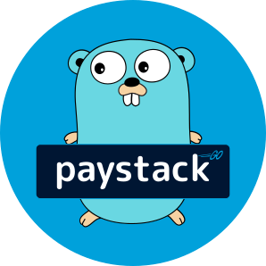
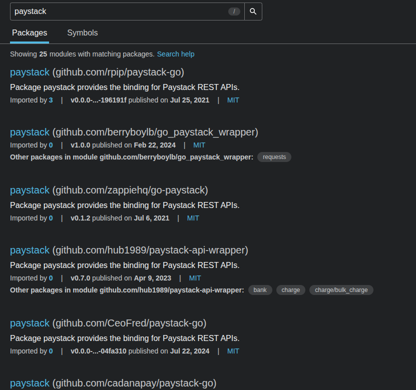

**An open source client for [Paystack](https://paystack.com) in GO**

Documentation: [https://gray-adeyi.github.io/paystack/](https://gray-adeyi.github.io/paystack/)

Source Code:
[https://github.com/gray-adeyi/paystack](https://github.com/gray-adeyi/paystack)

## TL;DR Motivation

The `github.com/gray-adeyi/paystack` package was created to provide a modern,
developer-friendly Go client for Paystack. Existing solutions like
`rpip/paystack-go` are outdated and fragmented across multiple forks due to
minor serialization issues. This package solves that by using Go generics and
reflection to offer flexible, customizable response models. It provides sensible
defaults while allowing developers to override them when needed—reducing
boilerplate and avoiding the need for forks.

[Get Started](get-started.md)

## Motivation

`github.com/gray-adeyi/paystack` is an open-source Go client designed to make
integrating Paystack into your Go applications both intuitive and
developer-friendly. It brings a fresh perspective on what a modern, reliable Go
SDK for Paystack should look like—prioritizing ease of use, maintainability, and
flexibility.

While surveying the Go ecosystem for existing Paystack clients, I found
`github.com/rpip/paystack-go` to be the most prominent and widely used package.
It served the community well for years. However, its lack of recent updates has
led to numerous forks, each attempting to fix unresolved issues, primarily
related to incorrect or outdated data serialization.

As a result, the Go package index is now cluttered with multiple forks of the
same project, each containing different fixes. For developers, this creates a
frustrating experience—choosing a package that **"just works"** becomes a
guessing game.

 _Click on image to zoom in_

Upon reviewing open issues and forks of `rpip/paystack-go`, I noticed that most
problems were minor: misspelled or missing fields in the response models. This
inspired the idea of shifting control of data serialization to the package
consumers themselves. The thinking was: _if developers can define their own
types, they won’t have to rely on upstream fixes for small bugs_.

In my first iteration, every API method returned a `Response` with its `Data`
field as a raw `[]byte`, leaving the consumer responsible for unmarshaling into
their own types. While this approach resolved the serialization issues of the
original package by putting control in the user’s hands, it introduced a new
problem—too much responsibility was pushed to the developer. Consumers had to
define and manage their own types across projects, which became cumbersome and
repetitive.

This led to a rethink: **could serialization be made flexible enough to provide
sensible defaults, while still allowing consumers to override them if needed?**
For example, when a Paystack API response changes or includes a new field,
consumers should be able to adapt without waiting for an upstream fix or forking
the library.

This idea forms the foundation of the current version. By leveraging Go’s
**generics and reflection**, this package now offers a set of built-in models
and a generic response wrapper: `Response[T]`, where `T` is the target type for
the response data. Each client method is documented with the default model it
uses, and consumers can still provide their own if needed.

This strikes a balance between **developer convenience and flexibility**,
ensuring that you can get started quickly with the defaults while still having
full control when necessary. Learn how to get started [here](get-started.md).

## Disclaimer

This project is an Open Source client library for
[Paystack](https://paystack.com/). It is not officially endorsed or affiliated
with [Paystack](https://paystack.com/). All trademarks and company names belong
to their respective owners.

## License

This project is licensed under the terms of the MIT license.

## Contributions

Thank you for being interested in contributing to
`github.com/gray-adeyi/paystack`. There are many ways you can contribute to the
project:

- [Star on GitHub](https://github.com/gray-adeyi/paystack/)
- Try `github.com/gray-adeyi/paystack` and
  [report bugs/issues you find](https://github.com/gray-adeyi/paystack/issues/new)
- [Buy me a coffee](https://www.buymeacoffee.com/jigani)

## Other Related Projects

| Name                                                                               | Language              | Functionality                                                                    |
| ---------------------------------------------------------------------------------- | --------------------- | -------------------------------------------------------------------------------- |
| [Paystack CLI](https://pypi.org/project/paystack-cli/)                             | Python                | A command line app for interacting with paystack APIs                            |
| [pypaystack2](https://pypi.org/project/pypaystack2/)                               | Python                | A client library for integrating paystack in python                              |
| [paystack](https://github.com/gray-adeyi/paystack)                                 | Go (This project)     | A client library for integration paystack in go                                  |
| [@gray-adeyi/paystack-sdk](https://www.npmjs.com/package/@gray-adeyi/paystack-sdk) | Typescript/Javascript | A client library for integrating paystack in Javascript runtimes (Node,Deno,Bun) |
| [paystack](https://pub.dev/packages/paystack)                                      | Dart                  | A client library for integration paystack in Dart                                |
